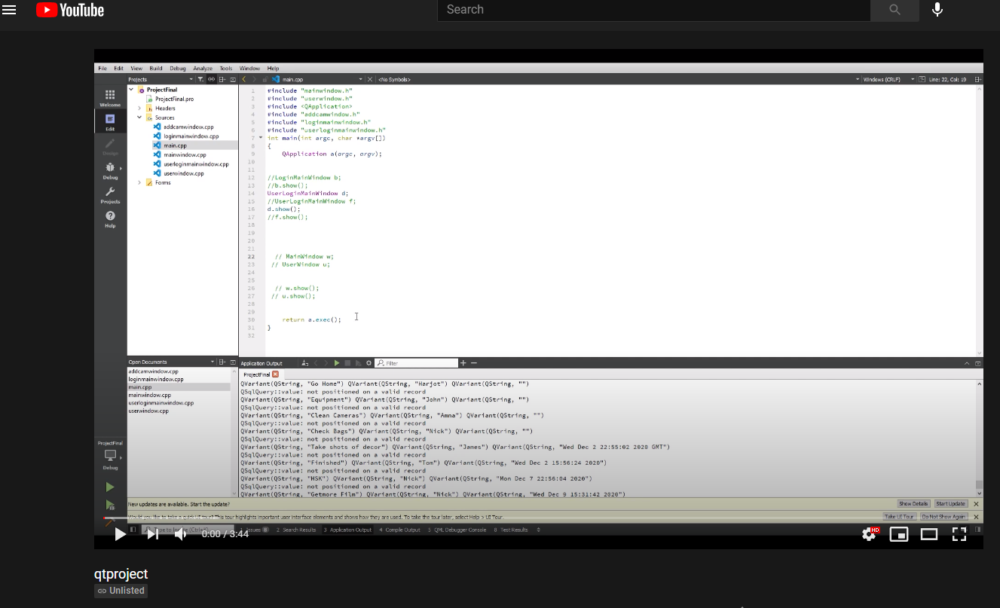
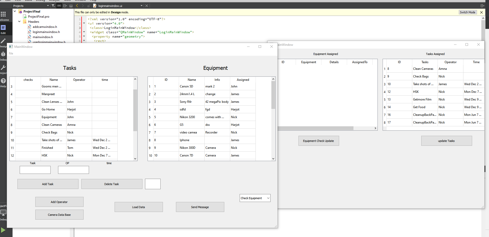

# Qt C++ Sqlite equipment-personnell management software

### Allows users to assign tasks to teams on live events for example 
### If your shooting a weeding this program allows you to assign eqiupment to team members along with tasks 
### the program also updates live if somone in team has finished task or not

## Video link showcasing running the program

[YoutubeLink](https://www.youtube.com/watch?v=91Tm8pVjL2Q"YoutubeLink")

## (A)

## (B)

## (C)
